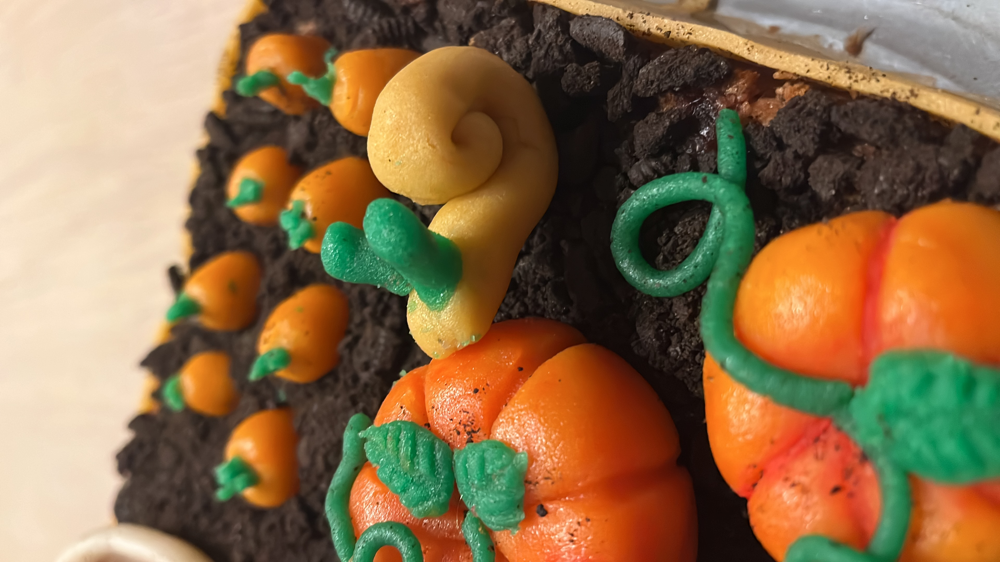

# 🌱 Garden Defense

A SwiftUI tower defense game where you protect your vegetable garden from hungry snails!



## 🎮 Game Overview

Defend your vegetable bed through day and night cycles:

- **Day Phase** (18 seconds): Your crops grow and you earn points. Build defenses to prepare for the night.
- **Night Phase** (18 seconds): Snails attack! Protect your vegetables or watch them get eaten.

### Features

- 🥕 **4 vegetable types**: Carrots, Tomatoes, Pumpkins, and Salad arranged in a 3×4 grid
- 🐌 **Multiple snail types**: Garden snails, shell snails, speedy snails, and slugs
- 🐅 **Tiger Snails**: Friendly predator snails (orange with black stripes) that hunt pests
- 🦔 **Hedgehog**: Release a hedgehog to help clear snails (costs 35 points)
- 🔨 **Defense types**: Metal Bars, High Voltage, and Razors
- 🌅 **Day/Night cycle**: Visual sun and moon animation showing time progression
- 📊 **Scoring system**: Earn points during the day, lose them when crops are attacked
- 🏆 **Leaderboard**: Persistent local leaderboard tracking names, points, skill, and days survived

### Controls

- **Click** on snails to remove them (earn points)
- **Drag** to place line defenses (Metal Bars, Razors)
- **Click** the Hedgehog House to release the hedgehog

### Win/Lose Conditions

- **Game Over**: When all vegetables are eaten OR points reach 0 during night
- The game gets progressively harder as pest pressure increases over time

## 🚀 Running the Game

### Prerequisites

- macOS with Swift 5.9+ installed
- Xcode Command Line Tools

### Build and Run

```bash
# Clone the repository
git clone <repository-url>
cd GardenDefense

# Build the project
swift build

# Run the game
swift run
```

Or build and run in one command:

```bash
swift run GardenDefense
```

### Build for Release

```bash
swift build -c release
.build/release/GardenDefense
```

### 📦 Create Distributable App

To create a universal `.app` bundle (runs on both Apple Silicon and Intel Macs):

```bash
./build-app.sh
```

This creates:
- `GardenDefense.app` - Universal binary (arm64 + x86_64), double-click to run
- `GardenDefense.tar.gz` - Ready to share
- `GardenDefense.tar.gz.blob` - For email transfer (many mail clients block compressed files)

The build script:
1. Cleans the build directory
2. Builds separately for arm64 (Apple Silicon) and x86_64 (Intel)
3. Combines both into a universal fat binary using `lipo`
4. Packages resources and creates the .app bundle + tar.gz archive
5. Creates a `.blob` copy for safe email transfer

### 🖥️ Running on Another Mac

1. Transfer `GardenDefense.tar.gz` to the target Mac
   - If sent via email as `.tar.gz.blob`, rename back to `.tar.gz` after downloading
2. Extract: `tar -xzf GardenDefense.tar.gz`
3. **First launch:** Right-click `GardenDefense.app` → **Open** → **Open**
4. Optionally move to Applications folder

**Requires:** macOS 11 (Big Sur) or later  
**Supported architectures:** Apple Silicon (M1/M2/M3/M4) and Intel

## 📁 Project Structure

```
GardenDefense/
├── Package.swift              # Swift Package Manager manifest
├── README.md                  # This file
├── build-app.sh               # Script to create distributable .app
└── Sources/
    └── GardenDefenseApp/
        ├── GardenDefenseApp.swift  # App entry point, sounds
        ├── GameModels.swift        # Game logic and state
        ├── GameView.swift          # SwiftUI views and UI components
        └── Leaderboard.swift       # Leaderboard persistence and UI
```

## 🎯 Tips for Beginners

1. Start building defenses during the first day
2. Metal Bars are cheapest (12 points) and block snails
3. Click on snails for quick points early game
4. Save up 35 points for the hedgehog - it's very effective!
5. Watch for Tiger Snails (orange/black striped) - they're helpers, don't click them!

## 📋 TODO & Feedback from Initial Users

- [ ] **Progressive difficulty** — The game is too easy once you've gathered some initial points. Make it successively harder. Consider adding levels.
- [ ] **Helper slugs should leave** — Leopard slugs currently gather in larger and larger numbers. They should move away after a while.
- [ ] **More active hedgehog** — The hedgehog is really lazy. Make it more aggressive or faster at hunting.
- [ ] **Leaderboard visibility** — Show the leaderboard more prominently, e.g. when pausing the game.
- [ ] **Escalating challenge** — As you progress, snails should move faster, spawn more frequently, or you get more crops to attend to.
- [ ] **Simplify scoring** — Consider dropping the skill system and just using points. Leaderboard ranking could be based on days survived.

## 📝 License

Made with ❤️ for Tjitske's 26th birthday!
